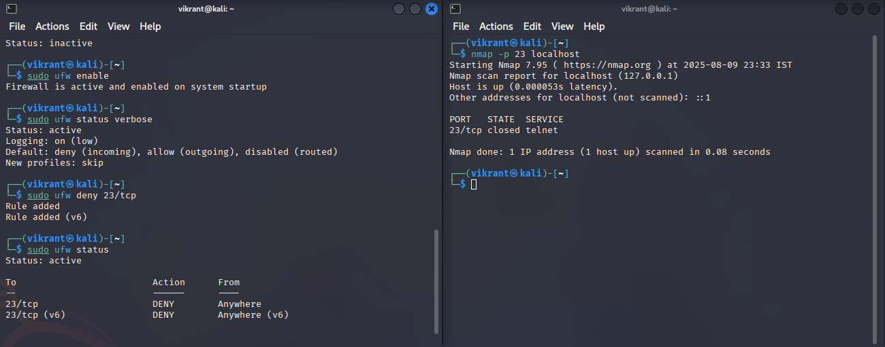
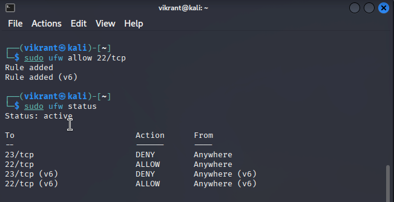
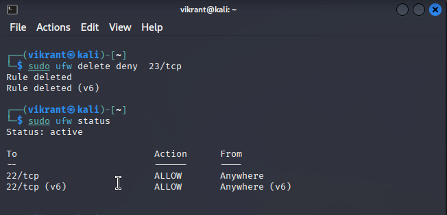

# elevate-cybersecurity-task4
Analysis and report for the Elevate Labs Cybersecurity Internship Task.
# Task 4: Firewall Configuration with UFW on Linux

## Objective
The objective of this task was to configure and test basic firewall rules to allow or block network traffic using UFW (Uncomplicated Firewall) on Linux.

## Tools Used
* **UFW (Uncomplicated Firewall):** The command-line tool used to manage the firewall on Kali Linux.
* **Nmap:** Used to test if the firewall rules were working correctly.

---

## Process and Commands Used
The following steps were performed to configure and test the firewall as required by the task.

1.  **Checked Initial Status:** The current state of UFW was checked to see if it was active.
    ```bash
    sudo ufw status
    ```

2.  **Enabled Firewall:** UFW was enabled to start with a secure default policy.
    ```bash
    sudo ufw enable
    ```

3.  **Blocked Inbound Traffic:** A rule was added to block inbound traffic on port 23 (Telnet).
    ```bash
    sudo ufw deny 23/tcp
    ```

4.  **Tested the Rule:** The block was verified by scanning the port with Nmap, which showed the port as `closed`, proving the firewall rule was effective.
    ```bash
    nmap -p 23 localhost
    ```

5.  **Allowed Inbound Traffic:** A rule was added to allow inbound traffic for the SSH service on port 22/tcp.
    ```bash
    sudo ufw allow 22/tcp
    ```

6.  **Cleaned Up:** The test rule blocking port 23 was removed to restore the firewall's state.
    ```bash
    sudo ufw delete deny 23/tcp
    ```

### Evidence of Commands and Testing
The following screenshots document the entire process, from enabling the firewall to testing and cleaning up the rules.

*Screenshot showing the firewall being enabled, the block rule for port 23 being added, and the successful test using nmap:*


*Screenshot showing the rule to allow SSH on port 22 being added:*


*Screenshot showing the test block rule being deleted to clean up:*


---

## How a Firewall Filters Traffic
A firewall acts as a barrier between a trusted internal network (like your PC) and an untrusted external network (like the internet). It inspects incoming and outgoing data packets and decides whether to allow them to pass or block them based on a set of security rules. By default, UFW is a **stateful firewall**, meaning it keeps track of active connections and automatically allows return traffic for connections that were initiated from inside. This prevents unsolicited external connections from reaching services on the computer, significantly improving its security.

## Key Learnings & Concepts

* **Inbound vs. Outbound Rules:** Inbound rules control traffic coming *into* the computer from the network, while outbound rules control traffic *leaving* the computer. Blocking unwanted inbound traffic is a primary security measure.
* **Why Block Port 23 (Telnet):** Telnet is an old and insecure protocol because it transmits all data, including usernames and passwords, in plaintext. It should always be blocked and disabled in favor of a secure alternative like SSH (port 22).
* **Stateful vs. Stateless Firewall:** A stateless firewall checks each packet against a set of rules individually, without any context. A stateful firewall (like UFW) is more advanced; it monitors the state of active connections and makes decisions based on the context of the traffic, offering better security.
